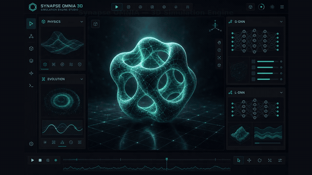
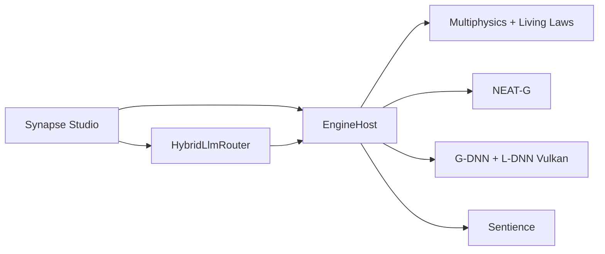

# SYNAPSE OMNIA — 3D Simulation Engine · v1.3

[](https://github.com/QuantumHacker10/Synapse/actions/workflows/build.yml)
[](https://github.com/QuantumHacker10/Synapse/actions/workflows/analysis.yml)
[](https://codecov.io/gh/QuantumHacker10/Synapse)
[](https://github.com/QuantumHacker10/Synapse/releases)
[](LICENSE)
[](global.json)

**Synapse OMNIA** is a **3D simulation engine**: a digital world you observe, modify, and
evolve — not a level editor for assembling static game scenes.
**Synapse Studio** is the workshop for editing a scene, running the simulation, and watching
shapes, laws, and inhabitants change together.

Where classic 3D tools *freeze* objects and *replay* immutable rules, Synapse *learns*,
*rewrites*, and *cultivates* the simulated world.

> **Product v1.3** — MIT-licensed open source. Synapse Studio + unified runtime (industrial physics, joints/vehicles,
> mesh provider, GPU-resident GI, cross-platform GLFW/Vulkan). Builds for **Windows x64**,
> **Linux x64**, and **macOS arm64** via CI / `scripts/publish-all.sh`.

**Landing page:** [quantumhacker10.github.io/Synapse](https://quantumhacker10.github.io/Synapse/) · **Releases:** [Download v1.3](https://github.com/QuantumHacker10/Synapse/releases)

## Demo



*Synapse Studio viewport: neural SDF geometry (G-DNN), dynamic lighting (L-DNN), and a live simulation world. [Full video (MP4)](docs/media/synapse-demo.mp4). On a GPU machine: `bash scripts/capture-studio-screenshot.sh` then `bash scripts/render-demo-media.sh`.*

## Table of contents

- [Why Synapse?](#why-synapse)
- [Prerequisites](#prerequisites)
- [Quick start](#quick-start)
- [Getting started tutorial](#getting-started-tutorial)
- [Configuration](#configuration)
- [Architecture](#architecture)
- [G-DNN + L-DNN pipeline](#g-dnn--l-dnn-pipeline)
- [Synapse Studio](#synapse-studio)
- [Publish](#publish-windows-x64)
- [Tests & CI](#tests--ci)
- [Contributing](#contributing)
- [License](#license)

## Why Synapse?

| Elsewhere (Unity, Unreal, Godot…) | Here |
|---|---|
| Hand-assembled scenes | A simulated world that evolves |
| Frozen shapes, triangulated meshes | Learned, continuous, infinitely zoomable shapes |
| Physics baked once and for all | Laws rewritten while the simulation runs |
| Every object modeled individually | Populations of shapes that mutate and get selected |
| AI often forced from the cloud | Local or remote assistance, on your terms |
| Scripted entities | Inhabitants that perceive, decide, and adapt |

Six rare ideas united in **one simulation engine**, not as separate plugins.

## Prerequisites

| Component | Version / detail |
|---|---|
| [.NET SDK](https://dotnet.microsoft.com/download) | **10.0.300** (see [`global.json`](global.json)) |
| GPU | Up-to-date **Vulkan** drivers (NVIDIA, AMD, Intel; MoltenVK on macOS) |
| Windows (publish) | `glfw3.dll` 3.4+ (see [glfw3.dll](#glfw3dll)) |
| LLM (optional) | [Ollama](https://ollama.com/) locally, or cloud API keys (see [Configuration](#configuration)) |

**Target platforms:** Windows, Linux, and macOS with native **GLFW + Vulkan** (MoltenVK on macOS). Official publish win-x64; Linux/macOS via `dotnet publish -r linux-x64|osx-arm64`. HWND embedding is Studio-on-Windows only.

## Quick start

```bash
# Clone and enter the repository
git clone https://github.com/QuantumHacker10/Synapse.git
cd Synapse

dotnet build
dotnet test

# Launch Synapse Studio (Avalonia UI)
dotnet run --project src/Synapse.Studio

# Engine-only GLFW mode, no UI (--glfw is an alias)
dotnet run --project src/Synapse.Studio -- --engine

# Load the sample scene
dotnet run --project src/Synapse.Studio -- --scene samples/demo.synapse
```

### glfw3.dll

Place `glfw3.dll` (GLFW 3.4+) next to the executable, or in
[`src/Synapse.Studio/native/`](src/Synapse.Studio/native/README.md) before publishing.

## Getting started tutorial

For a step-by-step walkthrough — building your first simulation, loading scenes, and
exploring G-DNN / L-DNN — see **[docs/getting-started.md](docs/getting-started.md)**.

For a module-level architecture overview with diagrams, see
**[docs/architecture.md](docs/architecture.md)**.

## Configuration

| Source | Parameters |
|---|---|
| [`src/Synapse.Studio/appsettings.json`](src/Synapse.Studio/appsettings.json) | Resolution, quality, physics/sim budgets, default LLM |
| CLI | `--width`, `--height`, `--scene`, `--quality`, `--validation` / `--no-validation`, `--engine` / `--glfw` |
| Environment variables | `SYNAPSE_WIDTH`, `SYNAPSE_HEIGHT`, `SYNAPSE_SCENE` |
| LLM (never hard-coded in the repo) | `OPENAI_API_KEY`, `ANTHROPIC_API_KEY`, `GEMINI_API_KEY`, `AZURE_OPENAI_API_KEY`, `OLLAMA_HOST` |

The [`HybridLlmRouter`](src/Synapse.LLM/HybridLlmRouter.cs) automatically switches between ONNX, Ollama, OpenAI, Anthropic, Gemini, and Azure based on availability, cost, and privacy.

## Architecture

Ten projects under `src/`, tests under `tests/` (solution [`Synapse.slnx`](Synapse.slnx)), sample scene under [`samples/`](samples/).

| Project | Role |
|---|---|
| `Synapse.Core` | Math/physics foundations (`PhysicsState` 256 bytes, algebra, octree, kd-tree, security) |
| `Synapse.Physics` | `LivingLawCompiler`; **RigidBodyWorld** (joints, vehicles, CCD, mesh colliders) + **MultiphysicsOrchestrator**; Maxwell, SPH, LBM… |
| `Synapse.AI` | `NeatGEvolutionEngine` — NEAT-G evolution, NSGA-II selection, SDF + L-DNN irradiance fitness |
| `Synapse.Genomics` | `GeoGenome` — shape genomes (builder, validation, registry, pool) |
| `Synapse.Rendering` | Vulkan RHI, G-DNN (SDF), L-DNN (GI + SSAO), LOD polygonization **QEM**, mesh→SDF, glTF export |
| `Synapse.LLM` | `HybridLlmRouter` — ONNX / Ollama / OpenAI / Anthropic / Gemini / Azure + lighting/SDF parsing |
| `Synapse.Simulation` | `SentienceManager` — entities, behavior trees, perception, digital twins |
| `Synapse.Infrastructure` | Adaptive quality, benchmarks, logging and config |
| `Synapse.Runtime` | `EngineHost` + `FrameOrchestrator` + **SynapseMeshProvider** + `.synapse` projects |
| `Synapse.Studio` | **Synapse Studio** — Avalonia editor + `--engine` GLFW mode |



## G-DNN + L-DNN pipeline

| Domain | Capabilities |
|---|---|
| **G-DNN (geometry)** | Neural SDFs, BVH broad-phase (`AABBTree`) for ray marching, adaptive LOD polygonization, disk cache of polygonized chains, mesh→SDF pipeline (`MeshToSdfPipeline`), glTF/GLB export |
| **L-DNN (lighting)** | Hybrid GI (SSGI + cascades + MLP), online path-tracing teacher, neural shadows, neural reflections/refractions, froxel fog + procedural clouds, Tiny/Small/Full profiles, static-scene GI cache |
| **Integration** | Extended G-Buffer (velocity + material ID), shadow pass in frame, hybrid RT wired, post styles (Cartoon / Grayscale / Noir) |
| **Studio / LLM** | LLM console → parse JSON lighting/SDF → L-DNN lights, fog/clouds, scene entities (`ApplyLlmSceneHints`) |

## Synapse Studio

Workshop for exploring and driving the simulation:

- **Real-time 3D view** — embedded Vulkan viewport (Windows HWND) with grid, gizmos, and editing tools (select, move, rotate)
- **`.synapse` projects** — open, save, and organize your scenes
- **Physical laws** — rewrite world rules without stopping the simulation
- **Evolution** — mutate shape populations, spawn agents, play/pause (Space)
- **Creative console** — describe a scene in natural language and watch the world react
- **Editing tools** — graph blueprints, sculpt, Megascans asset import
- **Dashboard** — frame rate (FPS), physics/sim load, adaptive quality and L-DNN GI

## Publish (Windows x64)

```bash
dotnet publish src/Synapse.Studio/Synapse.Studio.csproj -c Release -r win-x64 --self-contained true -o artifacts/Synapse-win-x64
```

Tags matching `v*` (e.g. `v1.1.0`, `v1.2.0`) trigger [`.github/workflows/release.yml`](.github/workflows/release.yml) and publish multi-platform archives on GitHub Releases.

## Tests & CI

```bash
dotnet test
```

xUnit + FluentAssertions suite under [`tests/Synapse.Tests`](tests/Synapse.Tests): Core, Physics, AI, Genomics, Rendering/G-DNN, L-DNN, LLM, Simulation, Runtime.

| Workflow | Role |
|---|---|
| [`build.yml`](.github/workflows/build.yml) | Ubuntu — tests + Coverlet coverage; Windows/Linux — publish artifacts |
| [`analysis.yml`](.github/workflows/analysis.yml) | Analyzers + `dotnet format --verify-no-changes` |
| [`release.yml`](.github/workflows/release.yml) | Multi-platform zip/tar.gz on tag `v*` |
| [`pages.yml`](.github/workflows/pages.yml) | Landing page deployment on GitHub Pages |

## Contributing

See **[CONTRIBUTING.md](CONTRIBUTING.md)** for the full Git workflow:

- Branches `feat/*` → `develop` → `main` (PRs required on `main`)
- [CHANGELOG.md](CHANGELOG.md) for version history
- Tags `v*` (e.g. `v1.2.0`) for releases — see [releases](https://github.com/QuantumHacker10/Synapse/releases)
- Local multi-RID publish: `bash scripts/publish-all.sh`

In short:

1. Fork, create a branch from `develop` (`feat/my-feature`)
2. `dotnet build && dotnet test` — CI must pass
3. Update CHANGELOG if the change is user-visible
4. Open a pull request toward `develop`

GitHub issues and discussions are open for bugs, ideas, and architecture questions.

## Site

Landing page in [`site/`](site/) — plain-language presentation of the 3D simulation engine,
with a download link to Releases.
Automatically deployed to [GitHub Pages](https://quantumhacker10.github.io/Synapse/) on every push touching `site/**`.

## License

**MIT License** — see [`LICENSE`](LICENSE) and [`COPYRIGHT`](COPYRIGHT).

You may use, modify, and distribute Synapse OMNIA under the MIT License. Contributions
are welcome — see [CONTRIBUTING.md](CONTRIBUTING.md).
