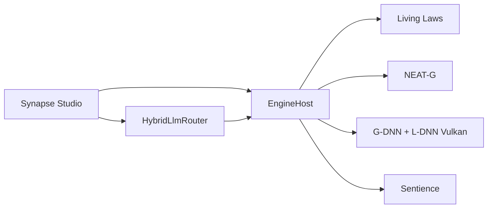

# SYNAPSE OMNIA — Synapse Engine 1.1

[](https://github.com/QuantumHacker10/Synapse/actions/workflows/build.yml)
[](LICENSE)
[](global.json)

Moteur de simulation et éditeur **Synapse Studio** en **C# 14 / .NET 10**.
Les moteurs 3D classiques *assemblent et simulent* ; Synapse *apprend, réécrit et cultive*
le monde simulé — formes neuronales (SDF), lois physiques vivantes, géométrie évolutive
(NEAT-G), agents sentients, routeur LLM multi-fournisseurs, rendu **Vulkan**.

> **Produit v1.1** — Synapse Studio (Avalonia) + runtime unifié (physique, simulation, AI, LLM, rendu).
> Surfaces Vulkan : **Windows** (HWND + GLFW), **Linux** / **macOS** (GLFW + MoltenVK).

**Site vitrine :** [quantumhacker10.github.io/Synapse](https://quantumhacker10.github.io/Synapse/) · **Releases :** [Télécharger v1.1](https://github.com/QuantumHacker10/Synapse/releases)

## Sommaire

- [Pourquoi Synapse ?](#pourquoi-synapse-)
- [Prérequis](#prérequis)
- [Démarrage rapide](#démarrage-rapide)
- [Configuration](#configuration)
- [Architecture](#architecture)
- [Pipeline G-DNN + L-DNN](#pipeline-g-dnn--l-dnn)
- [Synapse Studio](#synapse-studio)
- [Publish](#publish-windows-x64)
- [Tests & CI](#tests--ci)
- [Contribuer](#contribuer)
- [Licence](#licence)

## Pourquoi Synapse ?

| Ailleurs (Unity, Unreal, Godot…) | Ici |
|---|---|
| Forme = maillage figé de triangles | Forme = fonction apprise (SDF neuronal), continue et sans résolution fixe |
| Physique câblée une fois pour toutes | 100 lois en texte sur 18 domaines, compilées, versionnées, rechargées à chaud |
| L'artiste modélise chaque objet à la main | Populations de formes évoluées (NEAT-G) puis sélectionnées |
| IA générative souvent = un service cloud unique | Aiguilleur LLM local (Ollama / ONNX) + cloud, selon coût et confidentialité |
| Rendu et IA dans des outils séparés | Vulkan différé + ray tracing + illumination neuronale L-DNN dans le même runtime |
| PNJ scriptés | Agents sentients : perception, behavior trees, ordonnanceur actif/dormant sous budget frame |

Six idées rares réunies dans **un seul runtime** .NET, pas comme des outils séparés.

## Prérequis

| Composant | Version / détail |
|---|---|
| [.NET SDK](https://dotnet.microsoft.com/download) | **10.0.300** (voir [`global.json`](global.json)) |
| GPU | Pilote **Vulkan** à jour (NVIDIA, AMD, Intel ; MoltenVK sur macOS) |
| Windows (publish) | `glfw3.dll` 3.4+ (voir [glfw3.dll](#glfw3dll)) |
| LLM (optionnel) | [Ollama](https://ollama.com/) en local, ou clés API cloud (voir [Configuration](#configuration)) |

**Plateformes cibles :** Windows x64 (publish officiel), Linux et macOS via compilation locale.

## Démarrage rapide

```bash
# Cloner et entrer dans le dépôt
git clone https://github.com/QuantumHacker10/Synapse.git
cd Synapse

dotnet build
dotnet test

# Lancer Synapse Studio (interface Avalonia)
dotnet run --project src/Synapse.Studio

# Mode moteur GLFW seul, sans UI (--glfw est un alias)
dotnet run --project src/Synapse.Studio -- --engine

# Charger la scène d'exemple
dotnet run --project src/Synapse.Studio -- --scene samples/demo.synapse
```

### glfw3.dll

Placez `glfw3.dll` (GLFW 3.4+) à côté de l'exécutable, ou dans
[`src/Synapse.Studio/native/`](src/Synapse.Studio/native/README.md) avant le publish.

## Configuration

| Source | Paramètres |
|---|---|
| [`src/Synapse.Studio/appsettings.json`](src/Synapse.Studio/appsettings.json) | Résolution, qualité, budgets physique/sim, LLM par défaut |
| CLI | `--width`, `--height`, `--scene`, `--quality`, `--validation` / `--no-validation`, `--engine` / `--glfw` |
| Variables d'environnement | `SYNAPSE_WIDTH`, `SYNAPSE_HEIGHT`, `SYNAPSE_SCENE` |
| LLM (jamais en dur dans le dépôt) | `OPENAI_API_KEY`, `ANTHROPIC_API_KEY`, `GEMINI_API_KEY`, `AZURE_OPENAI_API_KEY`, `OLLAMA_HOST` |

Le routeur [`HybridLlmRouter`](src/Synapse.LLM/HybridLlmRouter.cs) bascule automatiquement entre ONNX, Ollama, OpenAI, Anthropic, Gemini et Azure selon disponibilité, coût et confidentialité.

## Architecture

Dix projets sous `src/`, tests sous `tests/` (solution [`Synapse.slnx`](Synapse.slnx)), scène d'exemple sous [`samples/`](samples/).

| Projet | Rôle |
|---|---|
| `Synapse.Core` | Fondations mathématiques / physiques (`PhysicsState` 256 octets, algèbre, octree, kd-tree, sécurité) |
| `Synapse.Physics` | `LivingLawCompiler` — 100 lois texte sur 18 domaines, hot-reload ; solveurs Maxwell, SPH, Lattice-Boltzmann, Schrödinger, N-corps, champs stochastiques |
| `Synapse.AI` | `NeatGEvolutionEngine` — évolution NEAT-G, sélection NSGA-II, fitness SDF + irradiance L-DNN |
| `Synapse.Genomics` | `GeoGenome` — génomes de formes (builder, validation, registry, pool) |
| `Synapse.Rendering` | Vulkan RHI, G-DNN (SDF), L-DNN (GI neuronale), polygonisation LOD, mesh→SDF, export glTF, styles artistiques |
| `Synapse.LLM` | `HybridLlmRouter` — ONNX / Ollama / OpenAI / Anthropic / Gemini / Azure + parse lighting/SDF |
| `Synapse.Simulation` | `SentienceManager` — entités, behavior trees, perception, jumeaux numériques |
| `Synapse.Infrastructure` | Qualité adaptative, benchmarks, logging et config |
| `Synapse.Runtime` | `EngineHost` + `FrameOrchestrator` + projets `.synapse`, application des hints LLM→scène |
| `Synapse.Studio` | **Synapse Studio** — éditeur Avalonia + mode `--engine` GLFW |



## Pipeline G-DNN + L-DNN

| Domaine | Capacités |
|---|---|
| **G-DNN (géométrie)** | SDF neuronaux, broad-phase BVH (`AABBTree`) pour le ray marching, polygonisation LOD adaptative, cache disque des chaînes polygonisées, pipeline mesh→SDF (`MeshToSdfPipeline`), export glTF/GLB |
| **L-DNN (éclairage)** | GI hybride (SSGI + cascades + MLP), teacher path tracing online, ombres neuronales, reflets/réfractions neuronaux, brouillard froxel + nuages procéduraux, profils Tiny/Small/Full, cache GI scènes statiques |
| **Intégration** | G-Buffer étendu (velocity + material ID), shadow pass dans la frame, RT hybride branché, styles post (Cartoon / Grayscale / Noir) |
| **Studio / LLM** | Console LLM → parse JSON lighting/SDF → lumières L-DNN, fog/nuages, entités scène (`ApplyLlmSceneHints`) |

## Synapse Studio

Interface Avalonia unifiée pour éditer, simuler et piloter le moteur :

- **Viewport Vulkan** — HWND embarqué (Windows) ou fenêtre GLFW (`--engine`)
- **Projets `.synapse`** — New / Open / Save, scene explorer et inspector
- **Living laws** — éditeur avec hot-reload des 100 lois physiques
- **Évolution NEAT-G** — populations de formes, spawn d'agents, play/pause simulation
- **Console LLM** — prompts naturels → paramètres d'éclairage et hints SDF appliqués à la scène
- **Outils créatifs** — blueprint editor, sculpt strokes, import Megascans
- **HUD performances** — FPS, budgets physique/sim, qualité adaptative

## Publish (Windows x64)

```bash
dotnet publish src/Synapse.Studio/Synapse.Studio.csproj -c Release -r win-x64 --self-contained true -o artifacts/Synapse-win-x64
```

Les tags `v*` déclenchent [`.github/workflows/release.yml`](.github/workflows/release.yml) et publient un zip win-x64 sur GitHub Releases.

## Tests & CI

```bash
dotnet test
```

Suite xUnit + FluentAssertions sous [`tests/Synapse.Tests`](tests/Synapse.Tests) : Core, Physics, AI, Genomics, Rendering/G-DNN, L-DNN, LLM, Simulation, Runtime.

| Workflow | Rôle |
|---|---|
| [`build.yml`](.github/workflows/build.yml) | Ubuntu — tests + Coverlet ; Windows — publish artefact |
| [`analysis.yml`](.github/workflows/analysis.yml) | Analyseurs + `dotnet format --verify-no-changes` |
| [`release.yml`](.github/workflows/release.yml) | Zip win-x64 sur tag `v*` |
| [`pages.yml`](.github/workflows/pages.yml) | Déploiement du site vitrine sur GitHub Pages |

## Contribuer

Voir **[CONTRIBUTING.md](CONTRIBUTING.md)** pour le flux Git complet :

- Branches `feat/*` → `develop` → `main` (PR obligatoires sur `main`)
- [CHANGELOG.md](CHANGELOG.md) pour l'historique des versions
- Tags `v*` (ex. `v1.1.0`) pour les releases — voir [releases](https://github.com/QuantumHacker10/Synapse/releases)

En bref :

1. Forker, créer une branche depuis `develop` (`feat/ma-fonctionnalite`)
2. `dotnet build && dotnet test` — la CI doit passer
3. Mettre à jour le CHANGELOG si le changement est visible
4. Ouvrir une pull request vers `develop`

Les issues et discussions GitHub sont ouvertes pour bugs, idées et questions d'architecture.

## Site

Page vitrine dans [`site/`](site/) — présentation produit, différenciation et lien de téléchargement Releases.
Déployée automatiquement sur [GitHub Pages](https://quantumhacker10.github.io/Synapse/) à chaque push touchant `site/**`.

## Licence

MIT — voir [`LICENSE`](LICENSE).
