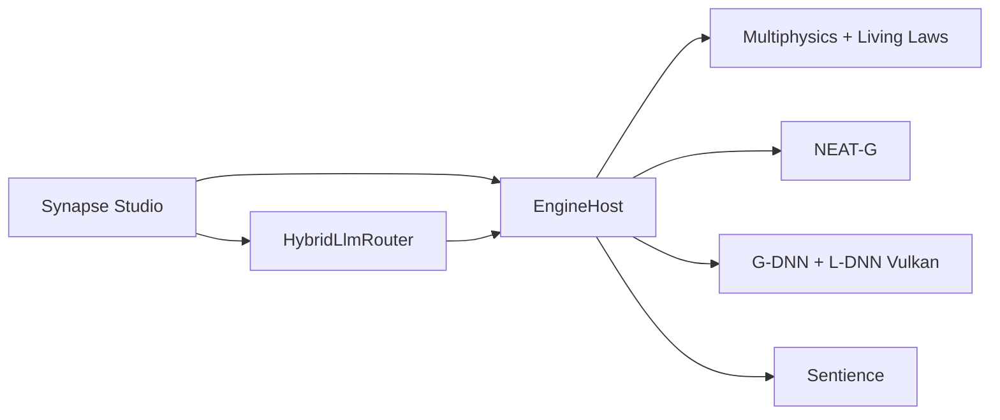

# SYNAPSE OMNIA — Outil de simulation 3D · v1.3

[](https://github.com/QuantumHacker10/Synapse/actions/workflows/build.yml)
[](https://github.com/QuantumHacker10/Synapse/actions/workflows/analysis.yml)
[](https://github.com/QuantumHacker10/Synapse/actions/workflows/codeql.yml)
[](https://codecov.io/gh/QuantumHacker10/Synapse)
[](LICENSE)
[](global.json)
[](tests/Synapse.Tests)

**Synapse OMNIA** est un **outil de simulation 3D** : un monde numérique que l'on observe,
modifie et fait évoluer — pas un moteur de jeu, ni une boîte à monter des niveaux.
**Synapse Studio** en est l'atelier pour éditer une scène, lancer la simulation et voir
comment formes, lois et agents sentients changent ensemble.

Là où les outils 3D classiques *figent* des objets et *rejouent* des règles immuables,
Synapse *apprend*, *réécrit* et *cultive* le monde simulé.

> **Produit v1.3** — Synapse Studio + runtime unifié (physique industrielle, joints/véhicules,
> mesh provider, GI GPU-résidente, multiplateforme GLFW/Vulkan, agents sentients, inspecteur live). Builds **Windows x64**,
> **Linux x64** et **macOS arm64** via CI / `scripts/publish-all.sh`.

**Site vitrine :** [quantumhacker10.github.io/Synapse](https://quantumhacker10.github.io/Synapse/) · **Releases :** [Télécharger v1.3](https://github.com/QuantumHacker10/Synapse/releases)

## Sommaire

- [Pourquoi Synapse ?](#pourquoi-synapse-)
- [Prérequis](#prérequis)
- [Démarrage rapide](#démarrage-rapide) — voir aussi **[GETTING_STARTED.md](GETTING_STARTED.md)**
- [Configuration](#configuration)
- [Architecture](#architecture)
- [Pipeline G-DNN + L-DNN](#pipeline-g-dnn--l-dnn)
- [Synapse Studio](#synapse-studio)
- [Captures d'écran](#captures-décran)
- [Publish](#publish-windows-x64)
- [Tests & CI](#tests--ci)
- [Contribuer](#contribuer)
- [Licence](#licence)

## Pourquoi Synapse ?

| Ailleurs (moteurs de jeu : Unity, Unreal, Godot…) | Ici (outil de simulation 3D) |
|---|---|
| Des scènes assemblées à la main pour le jeu | Un monde simulé qui évolue |
| Formes figées, découpées en triangles | Formes apprises, continues, zoomables sans limite |
| Physique gravée une fois pour toutes | Lois réécrivables pendant que la simulation tourne |
| Chaque objet modélisé individuellement | Populations de formes qui mutent et se sélectionnent |
| IA souvent imposée depuis le cloud | Assistance locale ou distante, selon vos contraintes |
| PNJ scriptés, joueur / avatar | Agents sentients qui perçoivent, décident et s'adaptent |

Six idées rares réunies dans **un seul outil de simulation**, pas comme des plugins séparés.

## Prérequis

| Composant | Version / détail |
|---|---|
| [.NET SDK](https://dotnet.microsoft.com/download) | **10.0.300** (voir [`global.json`](global.json)) |
| GPU | Pilote **Vulkan** à jour (NVIDIA, AMD, Intel ; MoltenVK sur macOS) |
| Windows (publish) | `glfw3.dll` 3.4+ (voir [glfw3.dll](#glfw3dll)) |
| LLM (optionnel) | [Ollama](https://ollama.com/) en local, ou clés API cloud (voir [Configuration](#configuration)) |

**Plateformes cibles :** Windows, Linux et macOS en **natif GLFW + Vulkan** (MoltenVK sur macOS). Publish officiel win-x64 ; Linux/macOS via `dotnet publish -r linux-x64|osx-arm64`. HWND = embed Studio Windows uniquement.

## Démarrage rapide

> Guide détaillé avec exemples C# : **[GETTING_STARTED.md](GETTING_STARTED.md)**

```bash
# Cloner et entrer dans le dépôt
git clone https://github.com/QuantumHacker10/Synapse.git
cd Synapse

dotnet build
dotnet test

# Lancer Synapse Studio (interface Avalonia)
dotnet run --project src/Synapse.Studio

# Mode moteur GLFW seul, sans UI (--glfw est un alias)
dotnet run --project src/Synapse.Studio -- --engine

# Charger la scène d'exemple
dotnet run --project src/Synapse.Studio -- --scene samples/demo.synapse
```

### Exemple : intégrer le runtime en C#

```csharp
using Synapse.Infrastructure.Configuration;
using Synapse.Infrastructure.Logging;
using Synapse.Runtime;

var config = SynapseConfig.Load();
await using var host = new EngineHost(config, SynapseLogger.Default);

host.InitializeModules();
host.InitializeRender(1280, 720);
// La loi active par défaut est "heat_equation" (définie dans la scène)

// Boucle principale
while (host.IsRenderInitialized)
{
    host.TickPhysics(1.0 / 60.0);
    await host.TickSimulationAsync();
    host.TickRender();
}
```

### Exemple : créer une scène `.synapse`

```json
{
  "name": "Ma scène",
  "version": "1.0",
  "activeLawId": "heat_equation",
  "entities": [{
    "id": "11111111-1111-1111-1111-111111111111",
    "name": "Sol", "type": "Mesh",
    "position": { "x": 0, "y": 0, "z": 0 },
    "scale": { "x": 10, "y": 0.2, "z": 10 },
    "visible": true
  }],
  "camera": { "position": { "x": 0, "y": 2, "z": 5 }, "yaw": -90, "pitch": 0, "fov": 60 },
  "assets": {}
}
```

### glfw3.dll

Placez `glfw3.dll` (GLFW 3.4+) à côté de l'exécutable, ou dans
[`src/Synapse.Studio/native/`](src/Synapse.Studio/native/README.md) avant le publish.

## Configuration

| Source | Paramètres |
|---|---|
| [`src/Synapse.Studio/appsettings.json`](src/Synapse.Studio/appsettings.json) | Résolution, qualité, budgets physique/sim, LLM par défaut |
| CLI | `--width`, `--height`, `--scene`, `--quality`, `--validation` / `--no-validation`, `--engine` / `--glfw` |
| Variables d'environnement | `SYNAPSE_WIDTH`, `SYNAPSE_HEIGHT`, `SYNAPSE_SCENE` |
| LLM (jamais en dur dans le dépôt) | `OPENAI_API_KEY`, `ANTHROPIC_API_KEY`, `GEMINI_API_KEY`, `AZURE_OPENAI_API_KEY`, `OLLAMA_HOST` |

Le routeur [`HybridLlmRouter`](src/Synapse.LLM/HybridLlmRouter.cs) bascule automatiquement entre ONNX, Ollama, OpenAI, Anthropic, Gemini et Azure selon disponibilité, coût et confidentialité.

## Architecture

Dix projets sous `src/`, tests sous `tests/` (solution [`Synapse.slnx`](Synapse.slnx)), scène d'exemple sous [`samples/`](samples/).

Documentation complémentaire :
- **[docs/ARCHITECTURE.md](docs/ARCHITECTURE.md)** — diagrammes Mermaid (pipeline, modules, CI)
- **[docs/API.md](docs/API.md)** — référence des APIs publiques par module

| Projet | Rôle |
|---|---|
| `Synapse.Core` | Fondations mathématiques / physiques (`PhysicsState` 256 octets, algèbre, octree, kd-tree, sécurité) |
| `Synapse.Physics` | `LivingLawCompiler` ; **RigidBodyWorld** (joints, vehicles, CCD, mesh colliders) + **MultiphysicsOrchestrator** ; Maxwell, SPH, LBM… |
| `Synapse.AI` | `NeatGEvolutionEngine` — évolution NEAT-G, sélection NSGA-II, fitness SDF + irradiance L-DNN |
| `Synapse.Genomics` | `GeoGenome` — génomes de formes (builder, validation, registry, pool) |
| `Synapse.Rendering` | Vulkan RHI, G-DNN (SDF), L-DNN (GI + SSAO), polygonisation LOD **QEM**, mesh→SDF, export glTF |
| `Synapse.LLM` | `HybridLlmRouter` — ONNX / Ollama / OpenAI / Anthropic / Gemini / Azure + parse lighting/SDF |
| `Synapse.Simulation` | `SentienceManager` — agents sentients (≠ PNJ), behavior trees, perception, jumeaux numériques |
| `Synapse.Infrastructure` | Qualité adaptative, benchmarks, logging et config |
| `Synapse.Runtime` | `EngineHost` + `FrameOrchestrator` + **SynapseMeshProvider** + projets `.synapse` |
| `Synapse.Studio` | **Synapse Studio** — éditeur Avalonia + mode `--engine` GLFW |



## Pipeline G-DNN + L-DNN

| Domaine | Capacités |
|---|---|
| **G-DNN (géométrie)** | SDF neuronaux, broad-phase BVH (`AABBTree`) pour le ray marching, polygonisation LOD adaptative, cache disque des chaînes polygonisées, pipeline mesh→SDF (`MeshToSdfPipeline`), export glTF/GLB |
| **L-DNN (éclairage)** | GI hybride (SSGI + cascades + MLP), teacher path tracing online, ombres neuronales, reflets/réfractions neuronaux, brouillard froxel + nuages procéduraux, profils Tiny/Small/Full, cache GI scènes statiques |
| **Intégration** | G-Buffer étendu (velocity + material ID), shadow pass dans la frame, RT hybride branché, styles post (Cartoon / Grayscale / Noir) |
| **Studio / LLM** | Console LLM → parse JSON lighting/SDF → lumières L-DNN, fog/nuages, entités scène (`ApplyLlmSceneHints`) |

## Synapse Studio

Atelier pour explorer et piloter la simulation :


- **Vue 3D temps réel** — viewport Vulkan embarqué (Windows HWND) avec grille, gizmos et outils d'édition (sélection, déplacement, rotation)
- **Projets `.synapse`** — ouvrir, sauver et organiser vos scènes
- **Lois physiques** — réécrire les règles du monde sans arrêter la simulation
- **Évolution** — faire muter des populations de formes, lancer des agents sentients, play/pause (Espace)
- **Console créative** — décrire une scène en langage naturel et voir le monde réagir
- **Outils d'édition** — blueprints graphiques, sculpt, import d'assets Megascans
- **Tableau de bord** — cadence (IPS), charge physique/sim, qualité adaptative et GI L-DNN

Les agents sentients ne sont pas des PNJ de jeu : ils perçoivent, mémorisent et décident dans le rythme de la simulation.

## Captures d'écran

| Vue | Description |
|---|---|
| [Studio — vue principale](docs/screenshots/studio-main-view.svg) | Hiérarchie, viewport, inspecteur, console LLM |
| [Rendu G-DNN + L-DNN](docs/screenshots/studio-rendering.svg) | SDF neural, GI hybride, SSAO, brouillard |

Voir [docs/screenshots/README.md](docs/screenshots/README.md) pour capturer vos propres PNG.

## Publish (Windows x64)

```bash
dotnet publish src/Synapse.Studio/Synapse.Studio.csproj -c Release -r win-x64 --self-contained true -o artifacts/Synapse-win-x64
```

Les tags `v*` déclenchent [`.github/workflows/release.yml`](.github/workflows/release.yml) et publient un zip win-x64 sur GitHub Releases.

## Tests & CI

```bash
dotnet test
```

Suite xUnit + FluentAssertions sous [`tests/Synapse.Tests`](tests/Synapse.Tests) : Core, Physics, AI, Genomics, Rendering/G-DNN, L-DNN, LLM, Simulation, Runtime.

| Workflow | Rôle |
|---|---|
| [`build.yml`](.github/workflows/build.yml) | Linux + macOS tests, Coverlet + Codecov, publish win/linux |
| [`analysis.yml`](.github/workflows/analysis.yml) | Analyseurs Roslyn + `dotnet format --verify-no-changes` |
| [`codeql.yml`](.github/workflows/codeql.yml) | Analyse de sécurité CodeQL (C#) |
| [`release.yml`](.github/workflows/release.yml) | Matrix win/linux/osx sur tag `v*` |
| [`pages.yml`](.github/workflows/pages.yml) | Déploiement du site vitrine sur GitHub Pages |

Couverture de code : `coverlet.runsettings` + upload Codecov. Audit dépendances : `scripts/verify-licenses.sh`.

## Contribuer

Voir **[CONTRIBUTING.md](CONTRIBUTING.md)** pour le flux Git complet et **[COMMUNITY.md](COMMUNITY.md)** pour les canaux de communication.

- **[ROADMAP.md](ROADMAP.md)** — vision et priorités publiques
- **[CODE_OF_CONDUCT.md](CODE_OF_CONDUCT.md)** — code de conduite
- **[SECURITY.md](SECURITY.md)** — signalement de vulnérabilités

- Branches `feat/*` → `develop` → `main` (PR obligatoires sur `main`)
- [CHANGELOG.md](CHANGELOG.md) pour l'historique des versions
- Tags `v*` (ex. `v1.2.0`) pour les releases — voir [releases](https://github.com/QuantumHacker10/Synapse/releases)
- Publish local multi-RID : `bash scripts/publish-all.sh`

En bref :

1. Forker, créer une branche depuis `develop` (`feat/ma-fonctionnalite`)
2. `dotnet build && dotnet test` — la CI doit passer
3. Mettre à jour le CHANGELOG si le changement est visible
4. Ouvrir une pull request vers `develop`

Les [issues](https://github.com/QuantumHacker10/Synapse/issues) et [discussions](https://github.com/QuantumHacker10/Synapse/discussions) GitHub sont ouvertes pour bugs, idées et questions d'architecture.

> **Mainteneurs :** activer Issues et Discussions dans **Settings → General → Features** si ce n'est pas déjà fait.

## Site

Page vitrine dans [`site/`](site/) — présentation de l'outil de simulation 3D, en langage clair,
avec lien de téléchargement Releases.
Déployée automatiquement sur [GitHub Pages](https://quantumhacker10.github.io/Synapse/) à chaque push touchant `site/**`.

## Licence

**Licence MIT — open source.** Vous pouvez utiliser, modifier, distribuer et créer
des simulations dérivées du code source, y compris à des fins commerciales, sous réserve
de conserver l'avis de copyright et la licence.

| Fichier | Contenu |
|---|---|
| [`LICENSE`](LICENSE) | Texte MIT |
| [`COPYRIGHT`](COPYRIGHT) | Copyright et marques |
| [`NOTICE`](NOTICE) | Avis standard (crédits) |
| [`LICENSE_HISTORY.md`](LICENSE_HISTORY.md) | Historique des changements de licence |
| [`THIRD_PARTY_NOTICES.md`](THIRD_PARTY_NOTICES.md) | Licences des dépendances |
