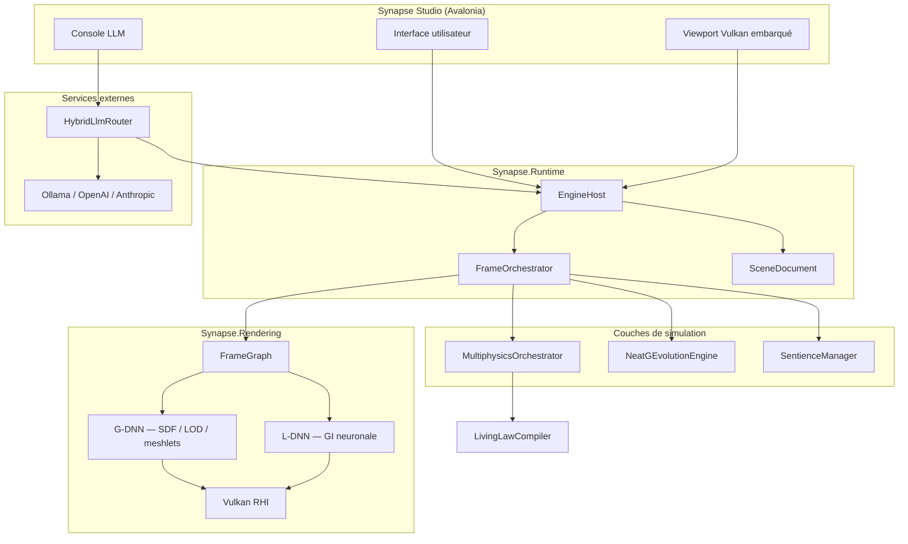
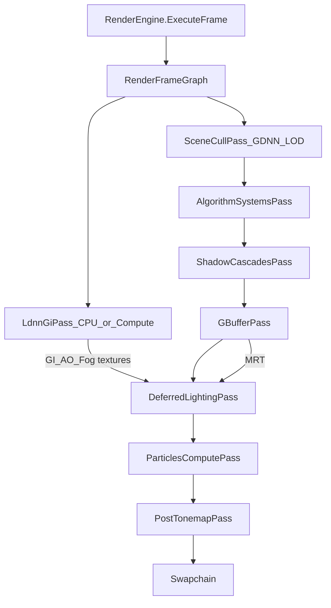
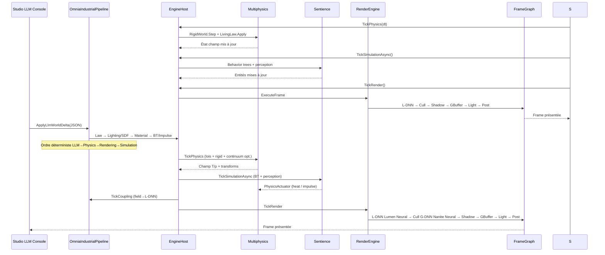
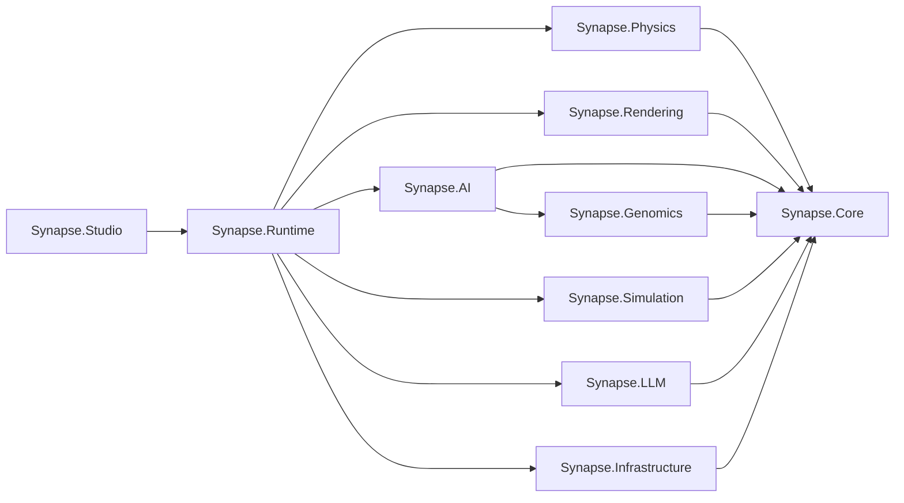
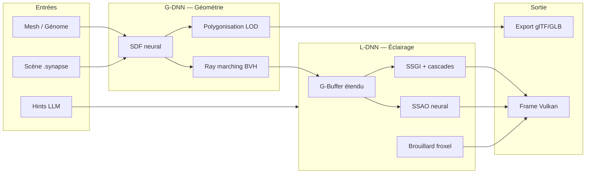
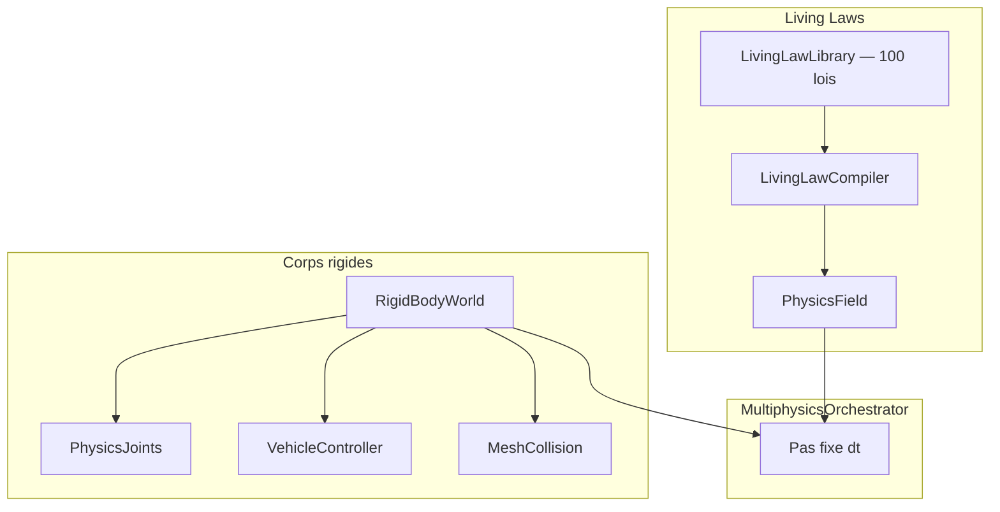
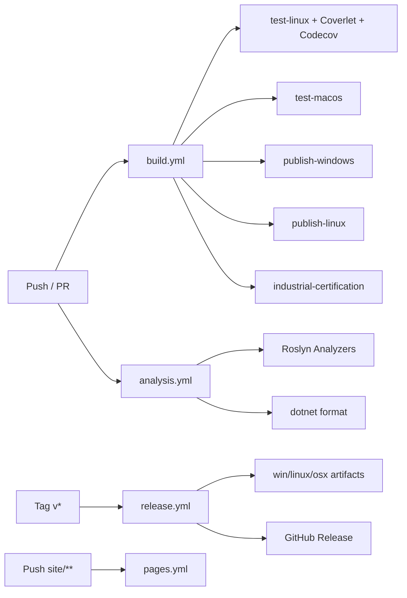

# Architecture — Synapse OMNIA

Diagrammes et vue d'ensemble de l'architecture du moteur de simulation 3D.

## Vue d'ensemble

## Pipeline de rendu — FrameGraph GPU-first

Le present path Vulkan n’est plus une séquence ad-hoc dans `SceneRenderer` :
il est piloté par un **FrameGraph** (`GDNN.Rendering.FrameGraph`) qui conserve
G-DNN et L-DNN comme modules de tech.

| Pass | Tech |
|---|---|
| `LdnnGiPass` | L-DNN Hybrid (SSGI + Radiance Cascades + neural) + upload batché |
| `SceneCullPass` | G-DNN `LodManager` + swap draw ranges |
| `AlgorithmSystemsPass` | **G-DNN complet** via `RenderingAlgorithmHub` + world partition / VT |
| `ShadowCascadesPass` | Shadow map + cascades PSSM (2 extras) + VSM clipmaps |
| `GBufferPass` | Deferred MRT + **PBR texture sampling** (albedo/normal/ORM) + **real velocity** |
| `DeferredLightingPass` | GGX + ClearCoat + IBL/SSR + **CSM** + **multi-lights (2–4)** |
| `ParticlesComputePass` | Particle sim + compute dispatcher (TAA/bloom/particle kernels) |
| `PostTonemapPass` | Bloom multi-tap + ACES + **GPU TAA** (velocity + history) |

### G-DNN sur le present path (`RenderingAlgorithmHub`)

Tickés chaque frame (ou one-shot résident) depuis `AlgorithmSystemsPass` → `SceneRenderer.OnFrameGraphAlgorithms` → `RenderingAlgorithmHub.TickCull` :

| Domaine | Systèmes | Flux visible / utile |
|---|---|---|
| Réseaux SDF | `HashEncodedDeepMLP`, `DeepMicroMLP`, `MicroMLP`, `QuantizedDeepMLP`, `HyperNetwork`→`MicroMLP`, `ISdfNetwork`, `MultiResolutionHashEncoder`, `NeuralLayerWeights` | Batch SDF → **AO contact** ; Hyper sample ; LOD |
| Trainers / assets | `OnlineSdfTrainer` (via pipeline), `HashEncodedDeepMLPTrainer`, `OfflineHashMeshTrainer`, `MeshToSdfPipeline`, `NeuralAsset`, `ReferenceMeshSdf`, `GDNNValidationProtocol` | One-shot train cube/sphere + validation report |
| Polygonization | `NeuralGeometryPipeline` (+ `PolygonizationCache` disque), `NeuralPolygonizer`, `NeuralMeshletBuilder`, `NeuralPolygonLodChain`, `NeuralClusterRenderer`, `SoftwareRasterizer`, `MeshletStreamer` | Meshlets → **fog** + **G-buffer inject** |
| Evaluation | `NeuralLodSelector`, `SceneEvaluator` (+ assets → `AABBTree`/`RayMarcher`), `SurfaceEvaluator`, `HierarchicalSdfCache`, `GradientCalculator`, `StochasticSphereTracer`, `WarpSpace` | Trace ray scène ; Warp skin sample |
| SIMD | `BatchSdfEvaluator`, `WaveOptimizedBatchEvaluator`, `BatchOps`, `MathFunctions`, `IntrinsicsHelper`, `MatrixOps`, `VectorOps` | Batch distances / normalize |
| Streaming | `AssetStreamer` (+ `AssetCache`), `AsyncPipeline`, `CompressionUtils`, `MeshletStreamer` | Request `gdnn_live` placeholder LZ4 ; **clusters résidents rasterisés → present path** (`TryRasterizeStreamedClusters`) |
| Streaming | `AssetStreamer` (+ `AssetCache`), `AsyncPipeline`, `CompressionUtils`, `MeshletStreamer` | Request `gdnn_live` placeholder LZ4 |
| Threading | `JobSystem`, `ParallelEvaluator`, `SynchronizedBuffer`, `WorkStealingPool` | Parallel SDF reduce + steal jobs |
| Memory | `StackAllocator`, `ZeroCopyBuffer`, `NativeBuffer`, `MemoryTracker`, `SpanExtensions`, `StreamingBuffer` | Scratch SDF / ring buffers |
| Spatial | `Octree`, `LooseOctree`, `SpatialHash`, `ConcurrentSpatialHash`, `AABBTree` | Insert cam + QueryAABB |
| Animation | `AnimationBlender`, `AnimationClip`, `Skeleton`, `JointTransform`, `SkinningWeights` | Idle clip → blend → skin matrices |
| Math helpers | `VectorMath`, `MatrixMath`, `QuaternionMath`, `TransformUtils` | TRS / slerp used by anim tick |
| Utilities | `Profiler`, `HashUtils`, `MathHelpers`, `DebugUtils`/`AssertUtils`, `BinaryReaderWriterExtensions` | Hash asset / assert / serialize |
| GPU | `MeshletRasterizerShaderGenerator`, `NeuralComputeShaderGenerator`, `DeepMicroMLPSpirvEmitter`, `SpirvToolchain`, `ShaderGenerator`, `ShaderCompiler`, `ShaderVariant`/`Manager`, `ConstantBufferLayout(Builder)`, `HLSLCodeGenerator` (via ShaderGen), **`VulkanNeuralSdfDispatcher.Shared`**, **`VulkanMeshletRasterizerDispatcher.Shared`** | SPIR-V / HLSL residency ; 2ᵉ device SDF + meshlets |
| Present feed | GPU/CPU meshlet vis → **fog** ; polygon mesh → **G-buffer** ; VT atlas → fog ; SDF → **AO** | Peinture live |

Bind-only / optionnel : `BindNeuralGeometry`, `BindMeshletPageFile`.

#### Checklist couverture G-DNN (`src/Synapse.Rendering/G-DNN/`)

| Zone | Statut |
|---|---|
| Polygonization/* | **WIRED** — pipeline + cache + meshlets + raster GPU/CPU → fog/GBuffer |
| Evaluation/* | **WIRED** — SceneEvaluator assets, tracers, WarpSpace, validation one-shot |
| Streaming/* | **WIRED** — RequestAsset + AsyncPipeline stage + Compression + MeshletStreamer |
| SIMD/* | **WIRED** — batch/wave + Intrinsics/Matrix/VectorOps chaque cull |
| Memory/* | **WIRED** — Stack/ZeroCopy/Native/Tracker/Span/StreamingBuffer |
| GPU/* | **WIRED** — codegen + compile + variants + CB pack + 2× Shared dispatchers |
| Animation/* | **WIRED** — clip idle + skeleton + blender + skinning + JointTransform |
| Core/NeuralNetwork/* | **WIRED** — nets + Hyper + MeshToSdf/Offline/Online trainers + NeuralAsset |
| Core/DataStructures/* | **WIRED** — Octree/Loose/Spatial/Concurrent/AABBTree/StreamingBuffer |
| Core/Mathematics/* | **WIRED** — utilisés par tick anim / coverage |
| Threading/* | **WIRED** — JobSystem + ParallelEvaluator + SynchronizedBuffer + WorkStealingPool |
| Utilities/* | **WIRED** — Profiler + Hash/Math/Debug/Binary helpers |

**Ne peint pas pleinement (infra / offline)** : `OfflineHashMeshTrainer` / `MeshToSdfPipeline` / `GDNNValidationProtocol` (one-shot init, pas un pass FrameGraph dédié) ; `ShaderCompiler` simule ou SPIR-V selon toolchain ; `AssetStreamer` sans fichiers `.gnn` génère un placeholder MicroMLP ; GPU 2ᵉ device absent → fallback CPU (`HlslCompatibleEvaluator` / `SoftwareRasterizer`).

**Device Vulkan optionnel (G-DNN SDF)** : `VulkanNeuralSdfDispatcher.Shared` crée un **2ᵉ `VulkanRhiDevice`** dédié au compute DeepMicroMLP (SPIR-V via glslang/DXC). Le present path Studio garde son device swapchain ; le hub ne dispose pas ce Shared (durée de vie process). Si SPIR-V/Vulkan init échoue (headless Linux sans `vulkan-1.dll`, toolchain absente), le hub retombe sur `HlslCompatibleEvaluator` (CPU). Coût : mémoire/driver d’un second device + `WaitForIdle` sur les dispatches SDF (cadencés ~toutes les 15 frames). Les distances SDF peignent l’AO contact sur le present path.

**Device Vulkan optionnel (G-DNN meshlets GPU)** : `VulkanMeshletRasterizerDispatcher.Shared` crée un **autre 2ᵉ `VulkanRhiDevice`** pour le compute raster Nanite-lite (`MeshletRasterizerShaderGenerator.GenerateGlslR32` → SPIR-V). Upload headers/positions/triangles → `vkCmdDispatch` (1 workgroup / meshlet) → readback visibility R32 → `RasterTarget` → `CompositeMeshletsIntoFog` + inject polygones G-buffer. Si SPIR-V/Vulkan indisponible, fallback **`SoftwareRasterizer`** (CPU Parallel.For). Cadence ~toutes les 8 frames avec le tick polygonization.

`MaterialTextureSystem` : décode les textures Megascans disque via `MegascansImageDecoder` (PNG 8/16-bit, JPEG baseline, BMP, TGA → RGBA8 → Vulkan `R16G16B16A16Sfloat`) pour le sampling G-buffer albedo/normal/ORM ; fallback procédural si fichier absent/corrompu ou format non supporté (EXR/TIFF). Atlas VT uploadé quand des tiles résidentes existent.

`RenderingAlgorithmHub` owns the previously orphaned Rendering algorithms and ticks them each frame into the present path (particles + **GPU/CPU meshlet vis → fog**, VSM clipmaps, VT streaming, world partition, Megascans bridge, compute residency, GPU SDF, **GPU meshlets**, **full G-DNN coverage**).

`SceneRenderer` reste la façade publique (meshes, materials, Studio) et le propriétaire
des ressources Vulkan ; `RenderEngine` appelle `ExecuteFrame` qui orchestre le graph.

### Cible d’impact Nanite / Lumen (honnête)

| Tech | Barre UE5.8 | Present path Synapse (session) | ~% impact on-screen vs UE5 |
|---|---|---|---|
| **G-DNN → Nanite** | Mesh shaders GPU, virtualized micropoly, continuous LOD, depth+material resolve | Dense meshlets (poly grid 20–36) + visibility buffer **256–512²** (GPU prefer / CPU fallback) → **G-buffer inject** + cluster albedo into GI/fog ; **`MeshletStreamer` clusters résidents rasterisés dans le present path** (jusqu’à 48 clusters/tick hors densify) ; LOD neural + frustum/backface | **~22–30%** (streamed clusters now reach the screen; pas de vrai micropoly hardware / streaming pages UE) |
| **L-DNN → Lumen** | Surface cache + software RT cascades, multi-bounce, specular | Hybrid SSGI (8 rays) + **6** radiance cascades **consommées directement** (`SampleScreenCascade`) + probe cache **semé** depuis les cascades + neural refine + multi-bounce proxy ; **`TemporalStabilizer` filtre le champ GI** frame-to-frame ; GI **domine** l’ambient plat ; AO/fog/GI upload **chaque frame** ; SSR proxy renforcé | **~28–35%** (cascades + probes indirects visibles et temporellement stables ; pas de surface cache UE / RT hardware) |

**Ce qui bloque encore la parité vraie** : pas de mesh-shader primary-device Nanite, pas de visibility-buffer material resolve GPU full-res, pas de Lumen surface cache / hardware ray tracing, Hybrid GI encore CPU-heavy (pas un compute GI resident chaque frame sur le device swapchain), second device optionnel pour meshlets/SDF.

## Pipeline par frame (simulation + rendu)
### Cible d’impact Nanite Neural 3.0 / Lumen Neural 3.0

| Tech | Present path Synapse (industriel + cinématique) | Capacité |
|---|---|---|
| **G-DNN — Nanite Neural 3.0** | Continuous LOD + **MeshletMaterialResolvePass** full-res ; `NaniteCinematicResolve` / `MeshShaderCompatGenerator` ; visibility jusqu’à **2048²** (Cinematic) | Géométrie neuronale dense + material resolve viewport |
| **L-DNN — Lumen Neural 3.0** | Surface cache + multi-bounce + **`LumenCinematicGi`** (GPU cache 96³ + full path-trace blend) | GI dynamique + mode Cinematic path-trace |
| **Upscaling** | **`UpscalePass`** après tonemap : FSR spatial / DLSS-compatible / MetalFX-compatible | Render scale &lt; 1 → display |
| **Continuum GPU-friendly** | **`GpuContinuumScheduler`** SPH+LBM+élasticité (Demo/Industrial/Cinematic) | Fluides / LBM / FEM-grille scène |

Activation native : `EngineHost.EnableCinematicStack()` ou `QualityPreset=Cinematic`.

## Pipeline industriel par frame — LLM → Physics → Rendering → Simulation

## Modules et dépendances

| Projet | Responsabilité | Dépend de |
|---|---|---|
| `Synapse.Core` | Math, PhysicsState, octree, kd-tree | — |
| `Synapse.Physics` | Living laws, rigid bodies, multiphysique | Core |
| `Synapse.Rendering` | Vulkan, G-DNN, L-DNN, shaders | Core |
| `Synapse.AI` | NEAT-G, évolution | Core, Genomics |
| `Synapse.Genomics` | Génomes de formes | Core |
| `Synapse.LLM` | Routeur multi-provider | Core |
| `Synapse.Simulation` | Entités sentientes | Core |
| `Synapse.Infrastructure` | Config, logging, qualité | Core |
| `Synapse.Runtime` | EngineHost, scènes, orchestration | Tous |
| `Synapse.Studio` | UI Avalonia + mode `--engine` | Runtime |

## Pipeline G-DNN + L-DNN

## Physique : living laws + rigid bodies

## CI/CD

## Taille des modules (indicatif)

Le monolithe `PhysicsState.cs` (276 Ko) a été découpé en **26 fichiers** modulaires :

| Fichier | Contenu |
|---|---|
| `PhysicalConstants.cs` | Constantes CODATA 2018 |
| `PhysicsEnums.cs` | Énumérations (FieldLayer, UnitSystem, etc.) |
| `Vector3D.cs`, `Tensor3D.cs`, `QuaternionD.cs` | Algèbre 3D |
| `GeometryPrimitives.cs` | AABB, Ray, Plane, Frustum |
| `AutoDiff.cs` | Différentiation automatique forward-mode |
| `PhysicsStateCore.cs` | Struct PhysicsState (256 octets) + opérateurs |
| `UnitConverter.cs`, `MaterialDatabase.cs` | Conversions et matériaux |
| `OctreeNode.cs`, `KdTree.cs`, `GridHash.cs` | Structures spatiales |

Autres gros modules (post-découpage v1.3) :

| Module | Fichiers | Contenu principal |
|---|---|---|
| `NeatGEvolutionEngine.*.cs` | 65 | Évolution NEAT-G (découpé depuis le monolithe) |
| `VulkanRhiDevice.*.cs` | 9 | Device Vulkan (découpé) |
| `Solvers.*.cs` | 56 | Solveurs numériques (découpé) |
| `LivingLawCompiler.cs` | ~294 KB | Compilateur de lois — **prochain candidat au découpage** |

Voir [CONTRIBUTING.md](../CONTRIBUTING.md) pour les conventions de contribution.
