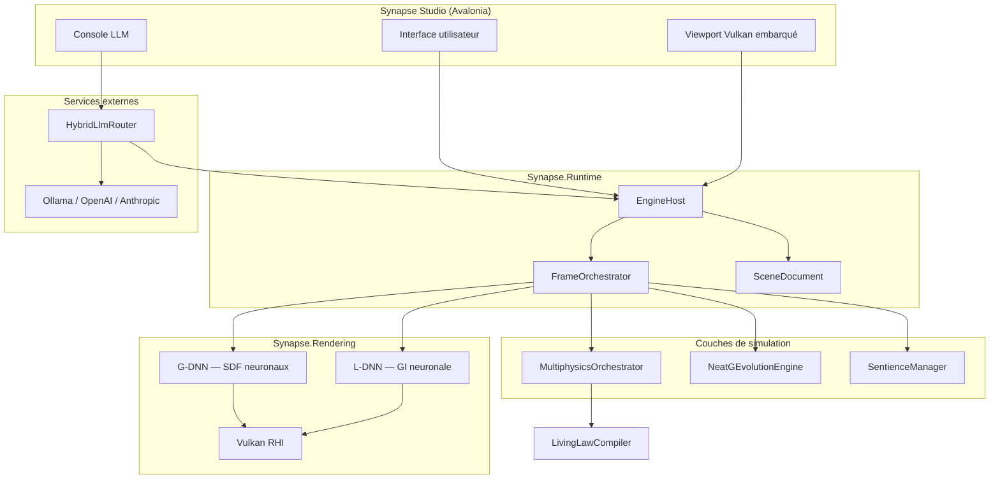
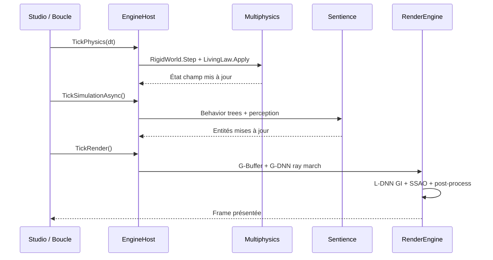
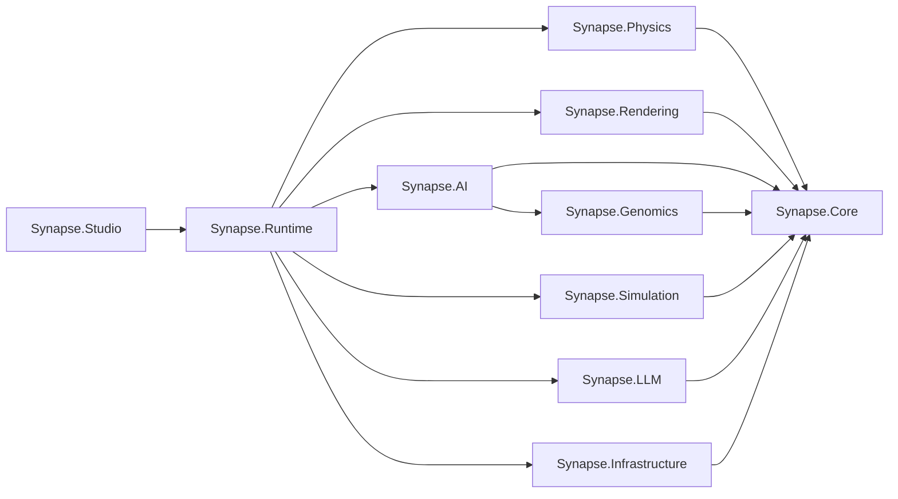
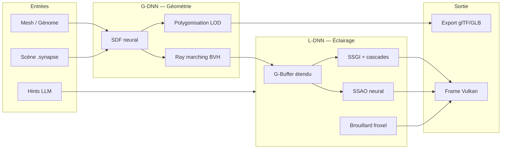
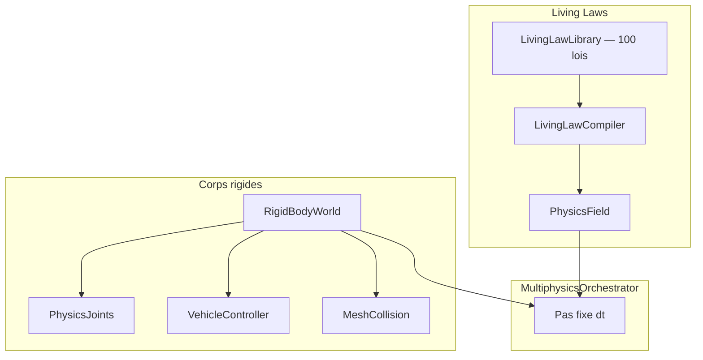
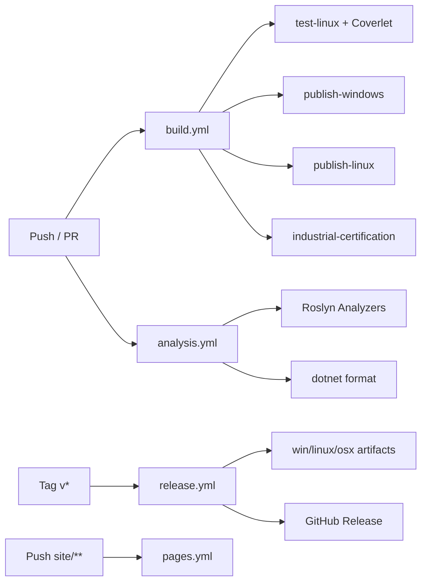

# Architecture — Synapse OMNIA

Diagrammes et vue d'ensemble de l'architecture du moteur de simulation 3D.

## Vue d'ensemble

## Pipeline par frame

## Modules et dépendances

| Projet | Responsabilité | Dépend de |
|---|---|---|
| `Synapse.Core` | Math, PhysicsState, octree, kd-tree | — |
| `Synapse.Physics` | Living laws, rigid bodies, multiphysique | Core |
| `Synapse.Rendering` | Vulkan, G-DNN, L-DNN, shaders | Core |
| `Synapse.AI` | NEAT-G, évolution | Core, Genomics |
| `Synapse.Genomics` | Génomes de formes | Core |
| `Synapse.LLM` | Routeur multi-provider | Core |
| `Synapse.Simulation` | Entités sentientes | Core |
| `Synapse.Infrastructure` | Config, logging, qualité | Core |
| `Synapse.Runtime` | EngineHost, scènes, orchestration | Tous |
| `Synapse.Studio` | UI Avalonia + mode `--engine` | Runtime |

## Pipeline G-DNN + L-DNN

## Physique : living laws + rigid bodies

## CI/CD

## Taille des modules (indicatif)

Les fichiers monolithiques suivants concentrent la logique de recherche. Un découpage progressif est recommandé pour la maintenance :

| Fichier | Taille | Contenu principal |
|---|---:|---|
| `NeatGEvolutionEngine.cs` | ~870 KB | Évolution NEAT-G |
| `VulkanRhiDevice.cs` | ~377 KB | Device Vulkan |
| `LivingLawCompiler.cs` | ~293 KB | Compilateur de lois |
| `PhysicsState.cs` | ~276 KB | Types fondamentaux + PhysicsState |
| `Solvers.cs` | ~292 KB | Solveurs numériques |

Voir [CONTRIBUTING.md](../CONTRIBUTING.md) pour les conventions de contribution.
