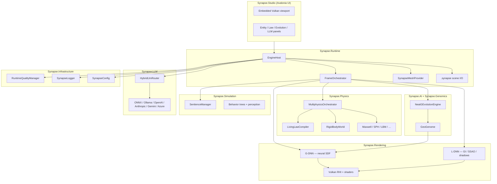
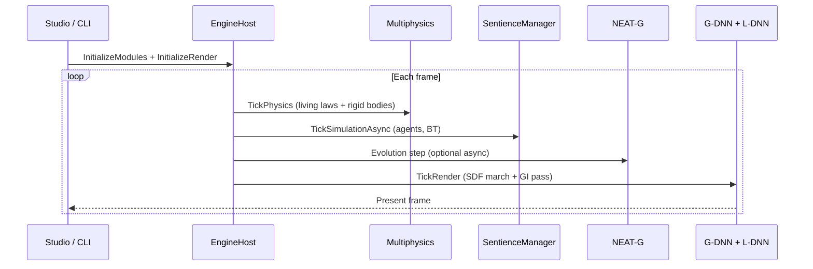
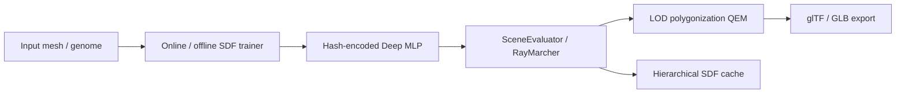
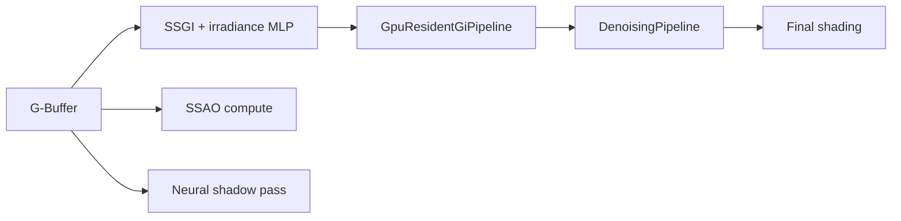
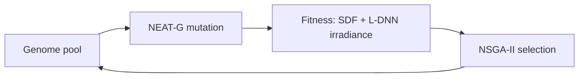
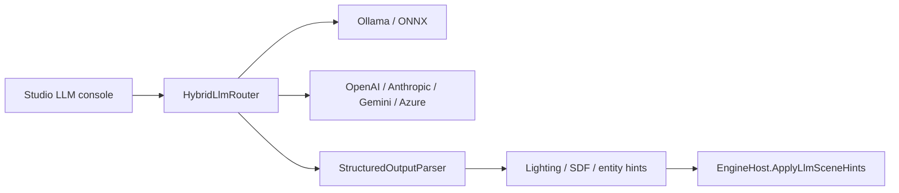

# Synapse architecture

This document describes how Synapse OMNIA modules fit together: runtime orchestration,
neural geometry (G-DNN), neural lighting (L-DNN), physics, AI evolution, and Studio.

## High-level overview

## Module reference

| Module | Namespace / project | Responsibility |
|---|---|---|
| **Core** | `Synapse.Core` | Shared math, `PhysicsState`, spatial structures (octree, kd-tree), security helpers |
| **Physics** | `Synapse.Physics` | Living laws compiler, rigid-body world (joints, vehicles, CCD, mesh colliders), multiphysics orchestration, continuum solvers |
| **AI** | `Synapse.AI` | NEAT-G evolution engine, NSGA-II multi-objective selection, fitness using SDF + irradiance |
| **Genomics** | `Synapse.Genomics` | `GeoGenome` — serializable shape genomes, validation, registry, pooling |
| **Rendering** | `Synapse.Rendering` | Vulkan RHI, G-DNN SDF pipeline, L-DNN lighting, QEM mesh simplification, glTF export |
| **LLM** | `Synapse.LLM` | Provider routing, rate limiting, caching, structured scene/lighting/SDF parsing |
| **Simulation** | `Synapse.Simulation` | Sentient entities, behavior trees, perception, digital twins |
| **Infrastructure** | `Synapse.Infrastructure` | Adaptive quality, benchmarks, centralized logging and configuration |
| **Runtime** | `Synapse.Runtime` | `EngineHost` facade, frame orchestration, mesh provider, scene documents |
| **Studio** | `Synapse.Studio` | Avalonia editor, embedded viewport (HWND), CLI `--engine` mode |

## Frame pipeline

### Physics tick

`MultiphysicsOrchestrator` coordinates:

- **Living laws** — compiled textual PDEs/fields hot-reloaded via `LivingLawCompiler`
- **Rigid bodies** — contacts, joints (hinge, ball, slider, distance), vehicles, CCD
- **Continuum solvers** — Maxwell, SPH, LBM, stochastic fields (when enabled)

### Render tick

1. **G-Buffer pass** — geometry + material IDs + velocity
2. **G-DNN evaluation** — neural SDF ray marching with BVH broad-phase (`AABBTree`)
3. **L-DNN lighting** — hybrid GI (SSGI + cascades + MLP), neural shadows, SSAO, fog
4. **Post-processing** — optional stylization (Cartoon / Grayscale / Noir)

## G-DNN (geometry neural network)

Key types live under `src/Synapse.Rendering/G-DNN/`:

- **NeuralNetwork** — `HashEncodedDeepMLP`, `MicroMLP`, `MeshToSdfPipeline`
- **Evaluation** — `RayMarcher`, `NeuralLodSelector`, `GradientCalculator`
- **Data structures** — `AABBTree`, `LooseOctree`, `SpatialHash`

## L-DNN (lighting neural network)

Key types live under `src/Synapse.Rendering/L-DNN/`:

- `IrradianceCacheManager`, `AmbientOcclusionSystem`, `DenoisingPipeline`
- `GpuResidentGiPipeline` — GPU-resident irradiance without CPU fill fallback

## AI evolution loop

`NeatGEvolutionEngine` runs asynchronously; `EngineHost` exposes generation count and best fitness to Studio.

## LLM integration

The router selects providers by availability, cost, and privacy — local-first when configured.

## Scene document model

`.synapse` files (`SceneDocument`) contain:

- **Entities** — mesh, character, genome types with transform and visibility
- **Camera** — position, yaw, pitch, FOV
- **Active law** — `activeLawId` referencing `LivingLawLibrary`
- **Assets** — optional external references (glTF, Megascans, etc.)

`SynapseMeshProvider` loads meshes, cooks collision shapes, and optionally bakes G-DNN SDFs.

## Tests and certification

Industrial physics certification runs in CI via filtered tests:

- Conservation laws, CCD, joints/vehicles, mesh provider, GPU-resident GI, DXC shader compilation

See [`tests/Synapse.Tests`](../tests/Synapse.Tests) and [`.github/workflows/build.yml`](../.github/workflows/build.yml).

## Further reading

- [Getting started tutorial](getting-started.md)
- [README](../README.md)
- [CONTRIBUTING.md](../CONTRIBUTING.md)
