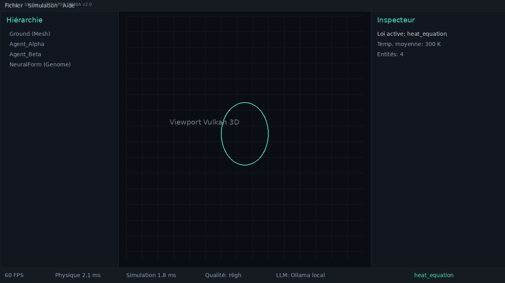
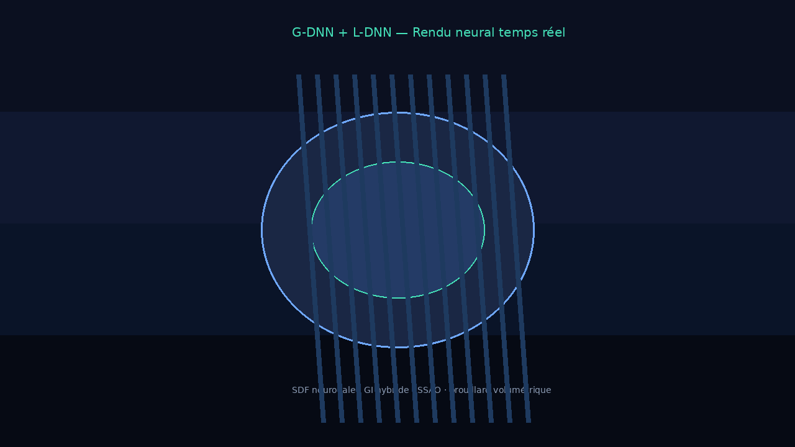

# Captures d'écran — Synapse Studio v2.1

Visuels **PNG** représentatifs de l'interface Synapse Studio.

> Les PNG sont générés via `scripts/generate-studio-screenshots.py` (layout fidèle à Studio v2).
> Pour des captures live depuis votre installation :
> `dotnet run --project src/Synapse.Studio -- --scene samples/demo.synapse`

## Vue principale

Interface complète : hiérarchie de scène, viewport Vulkan 3D, inspecteur, barre de performance et console LLM.



## Rendu G-DNN + L-DNN

Viewport en mode rendu : forme SDF neuronale (G-DNN), illumination globale (L-DNN), SSAO et brouillard.



## Régénérer les PNG

```bash
python3 scripts/generate-studio-screenshots.py
```

## Éléments visibles

| Zone | Description |
|---|---|
| Panneau gauche | Hiérarchie des entités (Mesh, Agent, Genome) |
| Viewport central | Rendu Vulkan embarqué avec grille et gizmos |
| Panneau droit | Inspecteur (propriétés, loi physique active) |
| Barre inférieure | IPS, charge physique, preset L-DNN, console LLM |

Les SVG originaux (`studio-main-view.svg`, `studio-rendering.svg`) restent disponibles comme source vectorielle.
